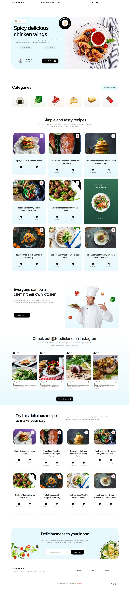
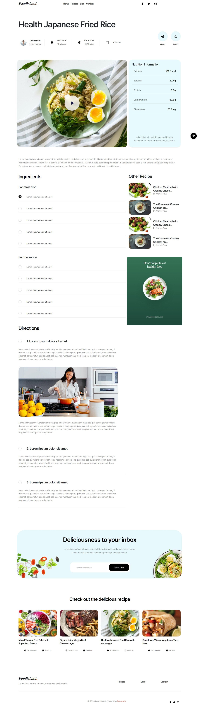
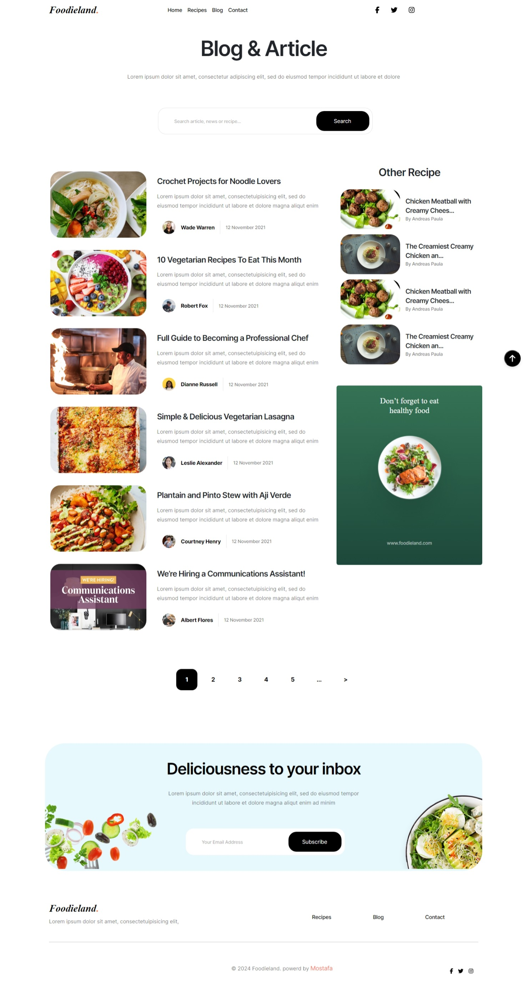
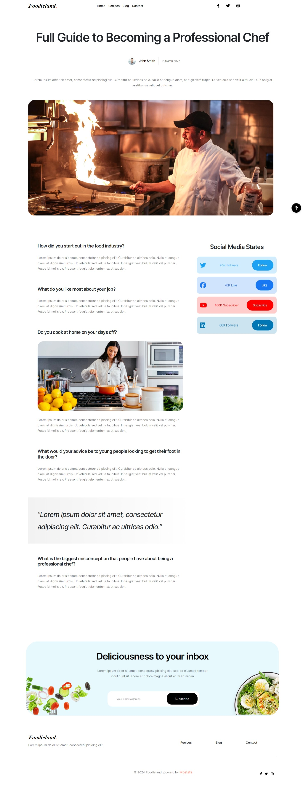
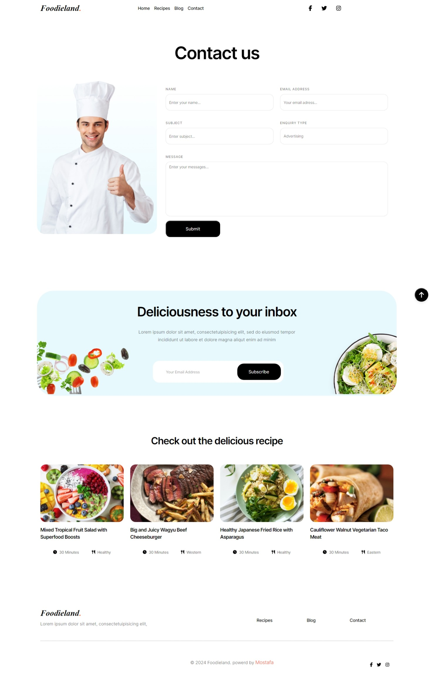

# Foodieland

## Images

<div style="display: flex; justify-content: space-around; align-items: start;">
    
    
    
    
    
</div>

Foodieland is a website dedicated to food enthusiasts. It provides recipes, cooking tips, and news about the latest trends in the food world.

**<a href="https://foodieland-steel.vercel.app/" target="_blank">Demo Project</a>**

## Contents

- [Introduction](#introduction)
- [Features](#features)
- [Installation and Running](#installation-and-running)
- [Usage](#usage)
- [Basic Structure](#basic-structure)
- [Technologies Used](#technologies-used)

## Introduction

Foodieland is a website developed using HTML, CSS, JavaScript, Bootstrap, and FontAwesome. The site aims to provide a wide range of recipes to users along with tips and news related to food.

## Features

- **Diverse Recipes:** A wide range of recipes from various global cuisines.
- **Responsive Design:** The site is designed to be responsive to fit all devices.
- **User-Friendly Interface:** The user interface is intuitive and easy to use.
- **Advanced Search:** Users can easily search for recipes using an advanced search engine.
- **Rating System:** Users can rate recipes and add them to favorites.

## Installation and Running

### Requirements

- A modern web browser

## Usage

Once you open the site, you can browse different recipes, search for specific recipes, and check out food-related tips and news.

## Technologies Used

- HTML
- CSS
- JavaScript
- Bootstrap
- FontAwesome


## Basic Structure

```plaintext
foodieland/
│
├── index.html
├── css/
│   ├── base/
│   │   ├── all.min.css
│   │   ├── bootstrap.min.css
│   │   ├── normalize.css
│   │   └── variables.css
│   ├── component/
│   │   └── (currently empty)
│   └── main.css
├── js/
│   ├── all.min.js
│   ├── bootstrap.bundle.min.js
│   ├── jquery-3.7.1.min.js
│   └── script.js
├── images/
│   ├── breakfast.png
│   ├── vegan.png
│   └── ...
├── webfonts
├── README.md
└── ...
